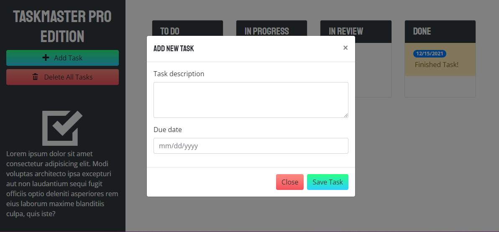

# taskmaster-pro
 Code a simple planner using jquery for DOM element manipulation, moment.js for time format manipulation and bootstrap for grid layout.

 ### taskmaster Criteria:
        - [✔️] Application uses JQuery for DOM manipulation.
        - [✔️] Uses moment.js for calendar.
        - [✔️] Tasks/events are saved in local storage.
        - [✔️] Tasks/events persists when reloading page.

Please see link below for the taskmaster-pro accessible URL: 
        https://darkjuanjo.github.io/taskmaster-pro/
        
**Below is the source code for the Work Day Scheduler Grading in GitHub. Please note that code is in assets/js. **
        https://github.com/darkjuanjo/taskmaster-pro

### Home Page

